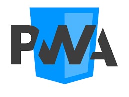
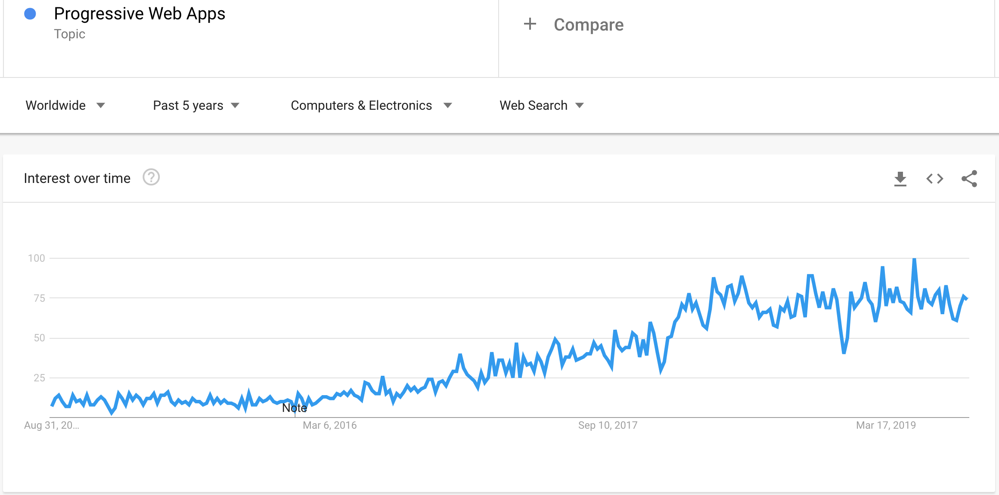

 

 

Progressive Web Apps (PWAs)
=====================

Welcome
---------------------

About the Course/Tutorial
---------------------

Hello All, I'm **`Dinanath Jayaswal, Senior Front-End/UI/Web Developer and Adobe Certified Expert Professional`**, I wanna welcome you to `Progressive Web Apps (PWAs)` course. In this course/tutorial, will learn the core building block concepts and essential technologies [like `Service Workers`, `Application Manifest`, `Responsive Design`, `Geolocation API`, `Media API`, `Promise and Fetch API`, `Web Push Notification` etc.] behind Progressive Web Apps (PWAs). Will cover and understand everything needed to build Progressive Web Apps (PWAs) that feels like a native mobile app.

Who this course is for? 
---------------------

The course aims to teach the core technologies behind Progressive Web Apps (PWAs).

This Course/Tutorial is ideal for:
- Freshers and aspiring UI/Mobile/Web developers
- Experienced UI/Mobile/Web developers (Front-End developer)
- Experienced Technical developers
- Technical/Team Leads

This course/Tutorial is for anyone and everyone, Almost everyone! This course is best suited for Web Developers looking to expand their skillset by building web apps that look and behave like native mobile apps.

Why learn Progressive Web Apps (PWAs)
---------------------
- Progressive Web Apps (PWAs) are the next hot and big thing in web development as `they bring mobile-app-like experiences to your users` without creating them with mobile SDKs and without requiring them to install an app from the Market place - Google Play Store / Apple App Store, Windows Store
- Progressive Web Apps (PWAs) is highly trending topic allowing us to build and deliver web apps with native mobile-like  features, look & feel and behavior
- To deliver Fast, Integrated, Reliable, Engaging `(FIRE)` and Discoverable experiences whilst still having the reach and accessibility of a web page

Course/Tutorial achievement
---------------------

Course/Tutorial Goal
---------------------

After completing/attending this Course/Tutorial, participants should be able to: 
1. Understand what & why Progressive Web Apps (PWAs)
1. Create Progressive Web Apps (PWAs) from scratch
3. Upgrade/convert a web application to full-featured Progressive Web Apps (PWAs)
2. Build a Web application which behaves like a native mobile app
3. Add features such as Camera and Microphone access, Service Workers for offline support, Push Notification messages, Geo-Location and more... into a web app

Prerequisites-Requirements for current course / What you need to know?
---------------------

- An understanding of basics to advanced level of `HTML5, CSS3 and JavaScript`
- Understanding of `Web technologies`, creating web pages, websites
- Basic knowledge of `JavaScript, TypeScript and ES6 syntax` would be beneficial and added advantage

`The primary focus for this tutorial is create-convert web site/web apps to Progressive Web Apps (PWAs)`. It is advisable to view following course/tutorials to get knowledge: **HTML5** - [HTML5 Essentials Tutorial](https://github.com/dinanathsj29/html5-essentials-tutorial), CSS3 - [CSS3 Fundamentals Tutorial](https://github.com/dinanathsj29/css3-fundamentals-tutorial), **JavaScript** [JavaScript tutorial for Beginners](https://github.com/dinanathsj29/javascript-beginners-tutorial), **Typescript** [Typescript tutorial for all](https://github.com/dinanathsj29/typescript-tutorial) and **ES6** - [ES6-ECMAScript6-ECMAScript2015-tutorial](https://github.com/dinanathsj29/ES6-ECMAScript6-ECMAScript2015-tutorial) before dive deeper with Progressive Web Apps (PWAs).

Topics included/covered
=====================

1. [Introduction to Progressive Web Apps (PWAs)](#1-introduction-to-progressive-web-apps-pwas)
    - 1.1. [Questions while creating a Mobile App](#11-questions-while-creating-a-mobile-app)
    - 1.2. [What is Progressive Web Apps (PWAs)?](#12-what-is-progressive-web-apps-pwas)
    - 1.3. [Progressive Web Apps (PWAs) Trend](#13-progressive-web-apps-pwas-trend)
    - 1.4. [What Progressive Web Apps (PWAs) are not?](#14-what-progressive-web-apps-pwas-are-not)
    
1 Introduction to Progressive Web Apps (PWAs)
=====================

1.1. Questions while creating a Mobile App
---------------------

#### 
Which language to use to create Mobile App?

- Java
- Swift

#### 
Which Devices to cover? App works on which platform/devices?

- Android
- Apple iOS

#### 
Which Framework to use to create Mobile App?

- React Native
- Flutter
- Adobe PhoneGap
- JQuery Mobile
- Xamarin

#### 
Which market plac/store to publish the app?

- Google Play Store
- Apple App Store
- Windows Store

1.2. What is Progressive Web Apps (PWAs)
---------------------

PWA is web sites/web app created with the help of emerging web technologies (HTML5, CSS3, Vanilla JavaScript), run in the browser, experience, behave and feel much like mobile app and can access or provide mobile native features like (install on mobile home screen, Access the app when offline, Get push notifications etc.)

More than just a buzzword, a Progressive Web Apps or `PWAs are a set of guidelines to utilize modern browser features` in a way that creates a more app-like user experience.

With PWAs no need to learn `new programming language`, `new framework`!

The term Progressive Web Apps was coined by *Alex Russell* and *Frances Berriman*. In Alex’s words:
> Progressive Web Apps are just websites that took all the right vitamins

A `development approach` of using a set of technologies that allows `web content to be app-like experience` including offline functionality, notifications, and device access

An `opportunity` to take these technologies and approach to `clean up and speed up current web-based projects`. All the tech involved are open standards that can be used in a pick and mix format

> Progressive Web Apps (PWAs) - bridging the gap between user and publisher

We can add a set of features/technologies to our WEB app/WEB page to enhance it to feel and work like a NATIVE mobile app. We can Progressively enhance our web apps to look and feel, behave like a native app

- Takes advantage of the latest technologies to **`combine the best of web and mobile apps`**
- Think of it as a website built using web technologies but which acts and feels like a mobile app
- Recent advancements in types of browsers, availability of Service Workers, Cache and Push API's have enabled web developers to allow users to:
  - Install web apps to their home screen
  - Receive push notifications
  - Work offline

1.3. Progressive Web Apps (PWAs) Trend
---------------------

It’s looking like Progressive Web Apps PWAs is a very hot topic these days, it is a standard from Google, which allows users to install and use a website as an app. In 2018, the search term `progressive web apps` is on top of popularity:

 <figure>
 &nbsp;&nbsp;&nbsp; 
 <figcaption>&nbsp;&nbsp;&nbsp; Image - Progressive Web Apps (PWAs) Google Trends</figcaption>
 </figure>

1.4. What Progressive Web Apps (PWAs) are not
---------------------

Progressive Web Apps (PWAs) are not:
- The end of all native app development
- What every web content needs to get converted into
